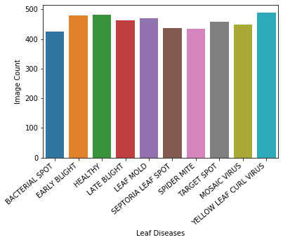
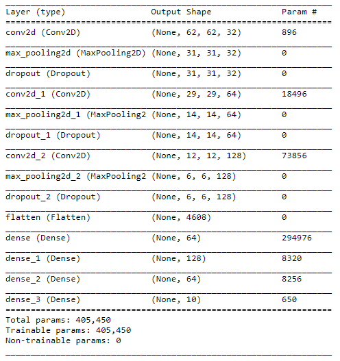
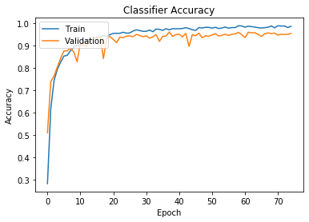
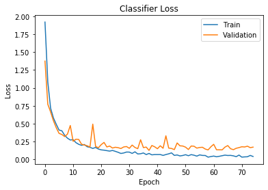
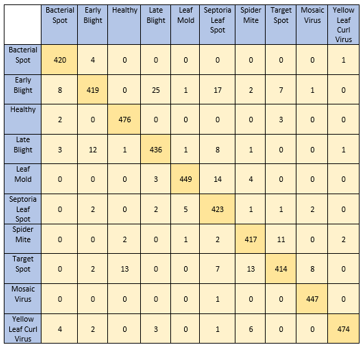
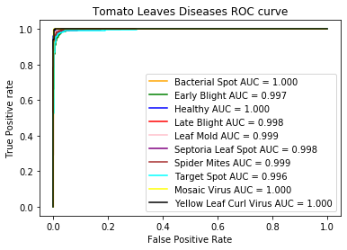

# Tomato-Leaf-Disease-Detection
A simple CNN model to detect and classify ten different types of tomato leaf disease.
Dataset taken from Kaggle. Link - https://www.kaggle.com/noulam/tomato.

### Train Images
A total of 18345 images were taken for training.

### Test Images
A total of 4585 images were taken for testing.

### Model Summary

### Training
A validation split 20% was used. The model was trained on 14676 images and validated on 3669 images for 75 epochs (50 epochs will do just fine).
The training accuracy was 98.63% while that of validation was 95.48%.

### Testing
Testing of the model was done on 4585 images. The accuracy was found to be 95.42%.
The ROC-AUC score was also calclulated and for each category of disease the AUC score was greater than 0.95.

